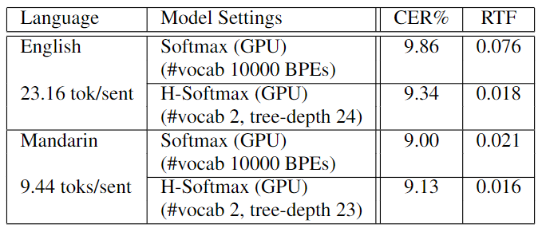

# Hierarchical Softmax (HSoftmax)
Implementation of hierarchical softmax based on Huffman tree

## Description
This project is based on [wenet](https://github.com/wenet-e2e/wenet).  
We implemented hierarchical softmax GPU/CPU training and decoding algorithm to leverage word frequence information for better performance on low-resources corpora and faster decoding speed compared to softmax.

Please refer to `wenet` for more info about how to run an experiment.  
To run an experiment, you need to install the wenet first (commit 15ccd07), then replace the wenet fold (source files) with ours.  

### Main Contributors 
With the order of participating the project:
- Qianying Liu (ying@nlp.ist.i.kyoto-u.ac.jp): Ideas and the main writer.
- Yuhang Yang (yuhangear@gmail.com): Prototyping.
- Zhuo Gong (gongzhuo@gavo.t.u-tokyo.ac.jp): Algorithm Optimizing and project management
- Zhengdong Yang (zd-yang@nlp.ist.i.kyoto-u.ac.jp): Experimenting  


## Usage
1) Build Huffman tree on train set text  
2) Train model with hierarchical softmax  
3) Test model with hierarchical softmax  

### Usage Details
Run the script as the following to build Huffman tree:  
```
python wenet/utils/huffman_tree.py \
--train-data dir/to/format.data \
--dict dir/to/lang_char.txt \
--tree-save-dir dir/to/tree
```
Add the following lines to train and test yaml files to enable hsoftmax
```
hsoftmax:
    # the value of tree-save-dir given to huffman_tree.py
    huffman_tree_dir: "dir/to/tree"
    # number of CPU parallel workers for CPU decoding.
    num_workers: 40
    # tree search beam_size, we suggest 1 for greedy search, in most cases this is good enough.
    beam_size: 1 
    # the number of simultaneous inference layer for each iteration of hsoftmax tree search, 1 for layer by layer search. 
    # we suggest 2 or 3, while larger value may lead to performance degeneration.
    multilayer_decoding: 2 
```
Or you can specify hsoftmax decoding configs using command line arguments in recognize.py
```
--hsoftmax_beam_size 1
--hsoftmax_multilayer_decoding 2
```

## Implementations
The main modifications compared to `wenet` lied in three files:
- wenet/transformer/hsoftmax_layer.py: Training and decoding logics
- wenet/utils/huffman_tree.py: Data preprocessing for building huffman-tree structure that's later used in hsoftmax_layer.py
- wenet/utils/hsoftmax_processpool.py: High efficient python-native multiprocessing implementation for CPU decoding.

### Main contribution in the codebase
```
# wenet/transformer/hsoftmax_layer.py

# Implemented the forwarding algorithm described in the paper
def forward(self, att: torch.Tensor) 

# Implemented GPU beam search with multi-layer searching 
# for high efficient decoding. Details in docs.
def beam_search_gpu(self, att: torch.Tensor, out_beam_size: int)
```

## Source Code for the Paper
``` bibtex
@misc{liu2023hierarchical,
      title={Hierarchical Softmax for End-to-End Low-resource Multilingual Speech Recognition}, 
      author={Qianying Liu and Zhuo Gong and Zhengdong Yang and Yuhang Yang and Sheng Li and Chenchen Ding and Nobuaki Minematsu and Hao Huang and Fei Cheng and Chenhui Chu and Sadao Kurohashi},
      year={2023},
      eprint={2204.03855},
      archivePrefix={arXiv},
      primaryClass={eess.AS}
}
```

## Performance
We reached a speedup in throughput of 4.19 in Librispeech using 10000 bpe tokens


## Core Concepts about HSoftmax GPU Training

